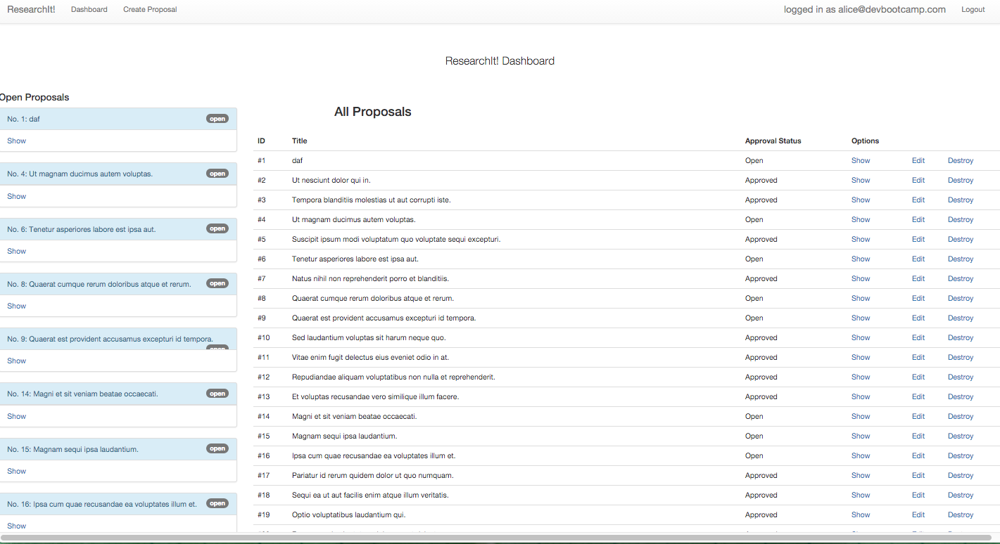
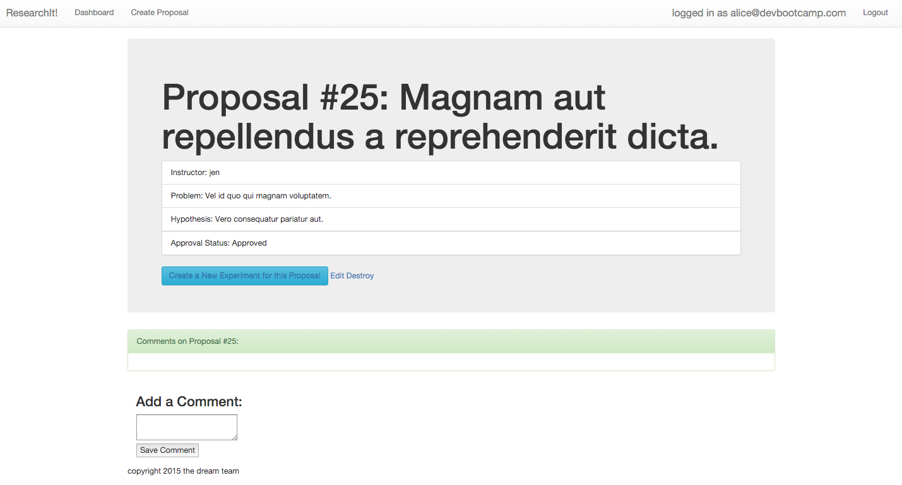

A Rails app written over for a make believe client as part of a team challenge completed during Dev Bootcamp. Our fake client, who worked for an alternative educational institution, wanted a way to track educational experiments that the institution's instructors had proposed

